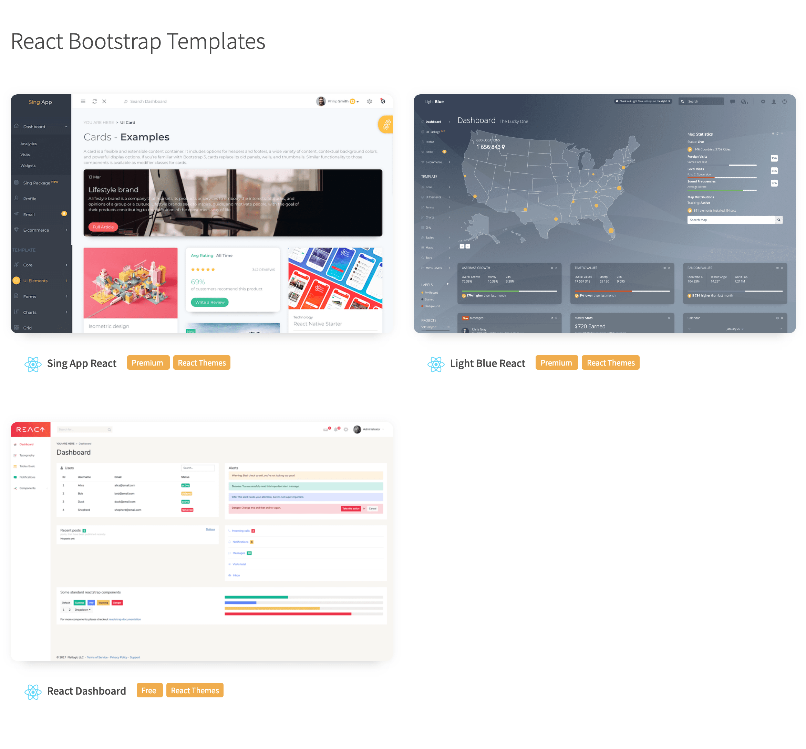

# Hackathon

## Quick Start

1. Clone the repo `git clone https://github.com/reduction-admin/react-reduction.git`
2. Go to your project folder from your terminal
3. Run: `npm install` or `yarn install`
4. No Windows pode ser necessário instalar python e vincular ao node com `npm config set python c:\python27\python.exe`
5. No Windows é necessário rodar o comando `npm install -g windows-build-tools` ou `yarn global add windows-build-tools`
6. After install, run: `npm run start` or `yarn start`
7. It will open your browser(http://localhost:3000)

## Note

React Reduction is built on top of [Create React App](https://github.com/facebook/create-react-app), which means all features that create-react-app supports are available.

To enable basic Google Analytics page tracking, you can add "REACT_APP_GOOGLE_ANALYTICS" variable in .env(or create env.production) file. For example, `REACT_APP_GOOGLE_ANALYTICS=xxxxxx` like this.

## More Bootstrap Themes

If you want more premium or free React Bootstrap themes, you can get it [here](https://flatlogic.com/admin-dashboards?ref=w7yTz44arn)

